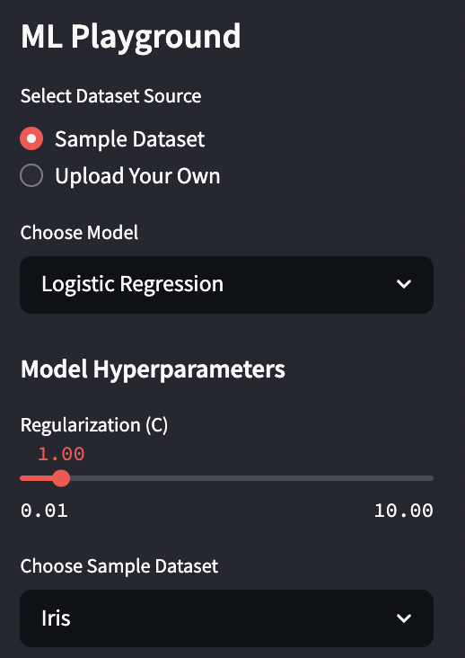
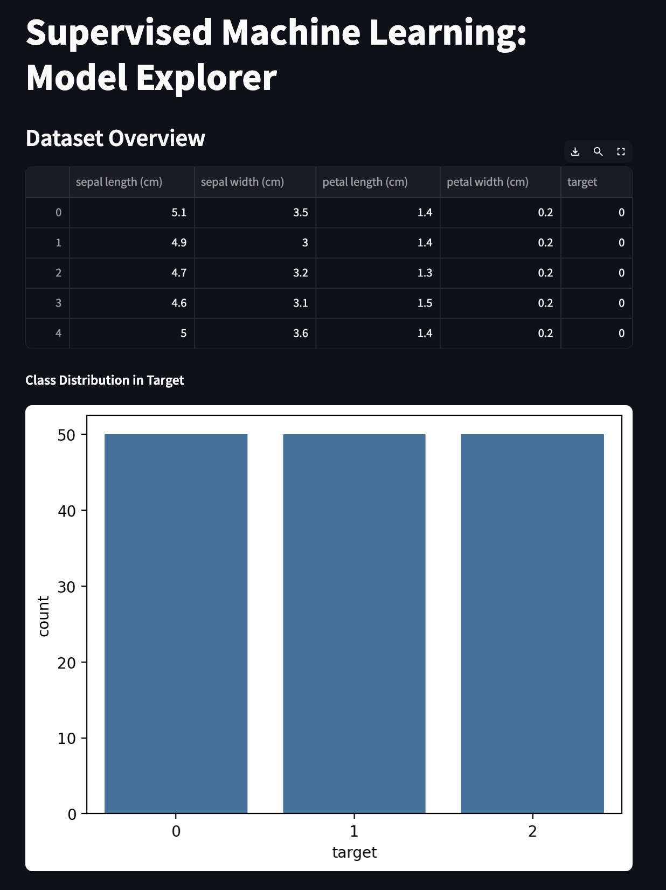
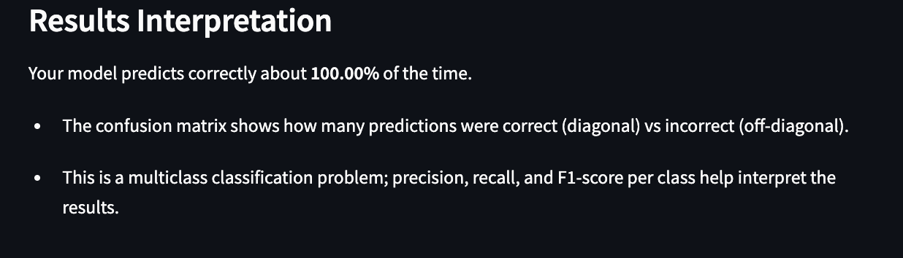

# Machine Learning Playground: Train Your Own Model with Streamlit

## Project Overview and Purpose
This web app was built with Streamlit to make supervised machine learning accessible, visual, and intuitive — even if you don’t know how to code. Whether you're a beginner exploring ML concepts or just want a fast way to prototype models, this tool lets you:

You can upload your own CSV file or use classic datasets provided, then experiment with different models and hyperparameters to see how they perform.

- Upload your own dataset *or* choose from classic built-in ones like **Option 1**, **Option 2**, or **option 3**
- Train models like **Logistic Regression**, **Decision Tree**, or **K-Nearest Neighbors**
- Tune hyperparameters interactively with sliders and dropdowns
- Visualize model performance with metrics, confusion matrices, and ROC curves

---

## How to Use the App
### 🔗 Deploy App
👉 [Check out the live app here!](https://daniella-yanez-hynqnvufsbjcmb8e9ewipq.streamlit.app/)


### Run Locally
**Clone this repo**
```bash```
git clone https://github.com/daniella-yanez/MLStreamlitapp.git
cd MLStreamlitapp

**Dependencies:**

- Python 3.10+
- streamlit >= 1.30
- pandas
- numpy
- matplotlib
- seaborn
- scikit-learn
- plotly

---

## App Features
### Models Implemented

- Logistic Regression ✅
  - Adjust regularization strength **(C)**
  - Choose **penalty** (L1, L2) and **solver** (liblinear, saga, etc.)
  - Visualize performance with confusion matrix and ROC curve

- Decision Tree ✅
  - Set **maximum depth** of the tree
  - Choose **criterion** (gini or entropy)
  - Adjust **minimum samples split**

- K-Nearest Neighbors (KNN) ✅
  - Choose **number of neighbors** (k)
  - Select **weighting method** (uniform or distance)
  - Set **distance metric** (euclidean, manhattan, etc.)

### Hyperparameter Tuning
- Each model offers dynamic sidebar controls using sliders and dropdowns to:
  - Customize model behavior (e.g., number of neighbors, depth, regularization)
  - Instantly retrain and update performance metrics
  - Optimize performance based on user-selected parameters

---

## Visuals
<h3>1. Interface Example</h3>


This screenshot shows the clean, interactive interface of the Machine Learning Explorer app. It includes:
- A preview of the uploaded dataset
- Automatically detected column types
- An overview of the target variable's distribution

**  **

<h3>2. Dataset Overview Example</h3>


This screenshot displays the top of the interface, showing:
- The uploaded dataset (Iris dataset in this example)
- A dynamic preview of feature columns and the target variable  

** **

<h3>3. Results Interpretation Example</h3>


This section explains what the model results mean in plain language:
- Summary of model accuracy
- Bullet points interpreting the confusion matrix and classification report
- Suggested next steps for users to refine their model  

## References
- [An Introduction to Statistical Learning](https://www.statlearning.com/)
- [RMSE vs. R-Squared: Which Metric Should You Use?](https://www.statology.org/rmse-vs-r-squared/)
