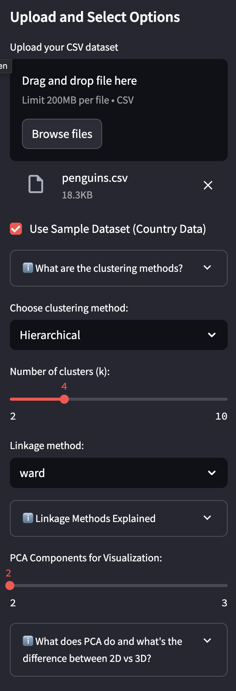
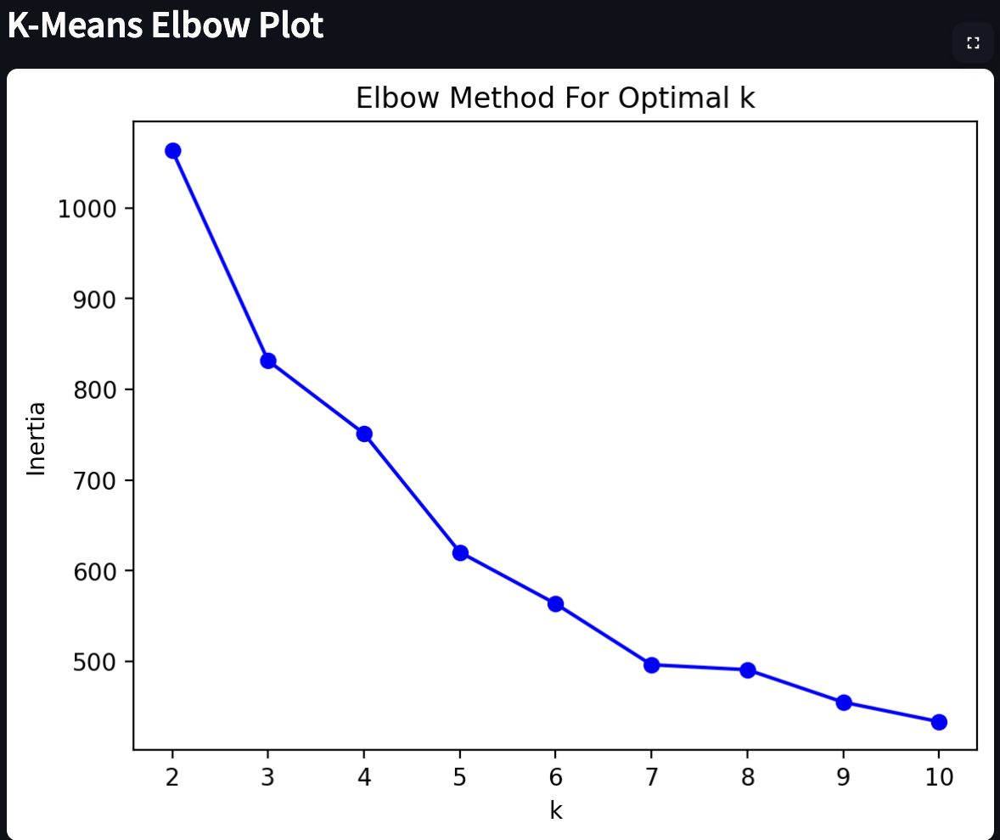
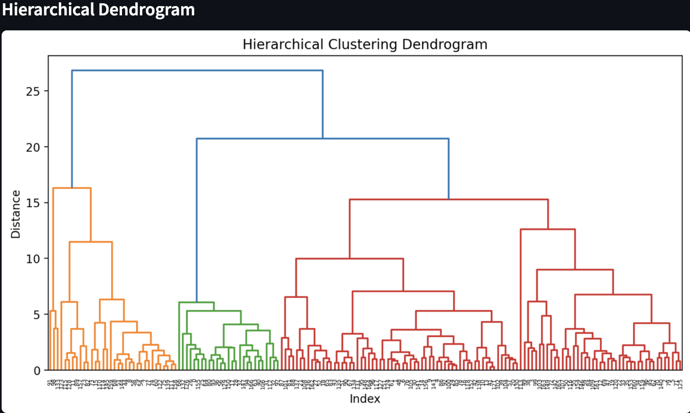
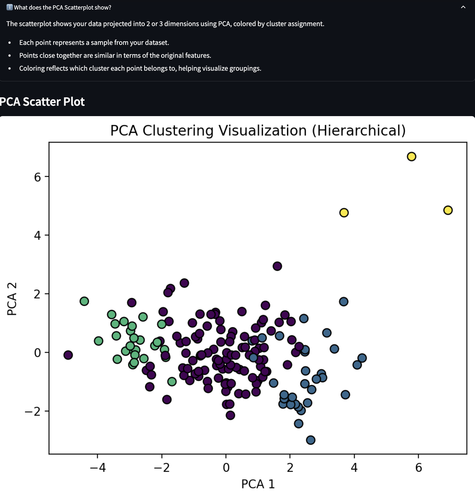

# Unsupervised Learning Explorer: Clustering & Dimensionality Reduction Web App

## Project Overview and Purpose

This Streamlit web application allows users to explore unsupervised learning techniques—specifically **K-Means Clustering**, **Hierarchical Clustering**, and **Principal Component Analysis (PCA)**—on any uploaded dataset. The goal of this project is to create an interactive tool for analyzing high-dimensional data, uncovering structure through clustering and dimensionality reduction.

With this app, users can:

- Upload a custom dataset (CSV format)
- Select a machine learning method to apply
- Adjust hyperparameters via interactive widgets
- Visualize results in real time
- Evaluate clustering quality with silhouette scores or dendrograms

---

## How to Use the App
### 🔗 Deploy App
👉 [Check out the live app here!](INPUTLINKHERE)

### Run Locally
**Clone this repo**
```bash```
git clone LINK SAMPLE: https://github.com/daniella-yanez/MLStreamlitapp.git REPLACE
cd MLStreamlitapp

**Install required packages:**
```bash```
pip install -r requirements.txt

**Dependencies:**

- Python 3.10+
- streamlit >= 1.30
- pandas
- numpy
- matplotlib
- seaborn
- scikit-learn
- scipy
- plotly

---

## App Features ##
### Models Implemented ###
- K-Means Clustering ✅
    - Choose number of clusters **(k)**
    - Visualize using 2D scatter plots
    - Evaluate with silhouette score
    - Elbow plot included to help identify optimal k

- Hierarchical Clustering ✅
    - Select **linkage type** (single, complete, average, ward)
    - Adjust distance threshold
    - View dendrogram and cluster output

- Principal Component Analysis (PCA) ✅
    - Choose **number of components**
    - View explained variance ratio
    - Visualize principal components in 2D

### Hyperparameter Tuning ###
- All models feature interactive controls via sliders and dropdowns to:
    - Modify clustering parameters (e.g., k or linkage method)
    - Select the number of PCA components
    - Recompute and visualize output dynamically

---

## Visual Examples (to be added later)

<h3>1. User Input Interface</h3>


**  **

<h3>2. K-Means Clustering Example</h3>

   
**  **

<h3>3. Hierarchical Clustering Dendrogram</h3>


**  **

<h3>4. PCA Scree Plot and 2D Projection</h3>


---

## References 🔗
- [scikit-learn Clustering](https://scikit-learn.org/stable/modules/clustering.html)

- [PCA in scikit-learn](https://scikit-learn.org/stable/modules/decomposition.html#pca)

- [Silhouette Score](https://scikit-learn.org/stable/modules/generated/sklearn.metrics.silhouette_score.html)

- [Streamlit Documentation](https://docs.streamlit.io/)

- [Plotly Python Library](https://plotly.com/python/)

---
## Contact
**For any questions, email daniellamartinezyanez7@gmail.com**
